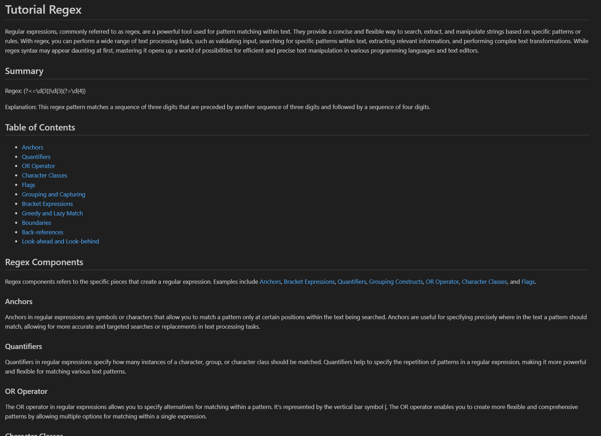

# Tutorial-Regex

## Description
Tutorial-Regex is a github repo used to describe the usefulness of Regular Expression and to provide an indepth explanation on points such as Anchors and Quantifiers.

